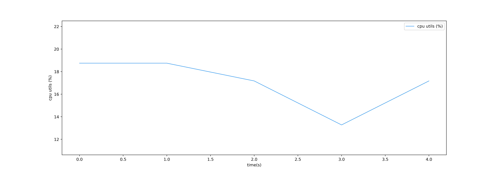

This is a linux system resources monitor builded mainly on top of `psutil` and `py3nvml`. The tool supports CPU utilization, Memory, disk IO and GPU utilization.

## Dependency

- python >= 3.6
- python dependency：
    - matplotlib
    - pandas
    - psutil
    - py3nvml

## Usage

### script for clearing memory buffer

```
./clear_buffers.sh
```

### start monitor

```shell
usage: monitor_main.py [-h] [--duration DURATION]
                       [--target-gpu [TARGET_GPU [TARGET_GPU ...]]]
                       [--output-path OUTPUT_PATH]
                       [--signal-frequence SIGNAL_FREQUENCE]

optional arguments:
  -h, --help            show this help message and exit
  --duration DURATION   time to monitor(default:60s)
  --target-gpu [TARGET_GPU [TARGET_GPU ...]]
                        target gpu to monitor(default:[0,])
  --output-path OUTPUT_PATH
                        log output path(default: ./)
  --signal-frequence SIGNAL_FREQUENCE
                        signal frequence(default: 1.6Hz)
```

for example:

```shell
python monitor_main.py --duration 60 --target-gpu 0 1 2 3 4
```


## log example
- log.csv
- log_visualization/

## log visualiztion example
